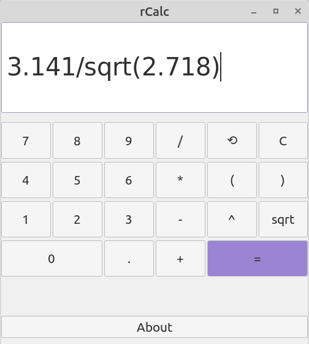

# rCalc

rCalc is a simple calculator created **as a hobby project to improve my C programming language knowledge and GUI creation skills**. GTK3 toolkit is used to create the GUI.




## Features

- Support the basic arithmetic operations and can calculate the square root and the power of a number.
- Parentheses are supported.
- Digital keyboard is supported (`enter` key can be used to display the result).
- Wrong and malformed expressions are handled with error messages.
- White spaces are recognized.
- Error-free expressions are saved into the internal history.
- Support deleting any character before the cursor's current position by pressing "⟲" button. 
- Display can be cleared by clicking on "C" button.


## How to build

### 1) Build using Make

Download and install [GTK3 Packages](https://www.gtk.org/docs/installations/linux). Download and install GNU Make if it is not installed. Then change directory to downloaded repository and then type:

```bash
$ make
```

To remove the compiled files (which can be found in the *obj/* directory) and the executable, just type:

```bash
$ make clean
```

### 2) Build manually

Download and install [GTK3 Packages](https://www.gtk.org/docs/installations/linux). Then change directory to downloaded repository and type:

```bash
$ gcc -o rCalc ./src/calc.c ./src/stack.c ./src/callbacks.c ./src/main.c -std=c99 -g3 -Wall -I./include `pkg-config --cflags --libs gtk+-3.0` -lm
```

And then execute rCalc:

```bash
$ ./rCalc
```

- *Note 1 : The compiled files (.o) will not be created when building manually.*

- *Note 2 : Due to my decision to write the calculator only in plain C, I ignored the warning messages about using deprecated functions*.

  

## Usage

rCalc works like any calculator, it follows rules of operator precedence. 

The minus sign '-' is unary, that is, to calculate a substraction, you **MUST** use parentheses for the number that is after the minus sign. 

For example, to calculate 3.141-2.718, typing `3.141-2.718` is wrong, but `3.141-(2.718)` or `3.141+(-2.718)`  gives a true result. `3-(sqrt(9))` gives syntax error while `3-sqrt(9)` doesn't.

The multiplication sign '*' cannot be omitted. `3.141(2.718)` or `(3.141)(2.718)` gives syntax error.

To display the precedent operation, click on the "⟲" button (the entry must be ***empty***).


## License

The MIT License (MIT) 2021 - [ilrffy](https://github.com/ilrffy).
